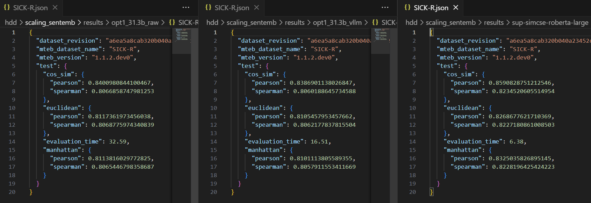
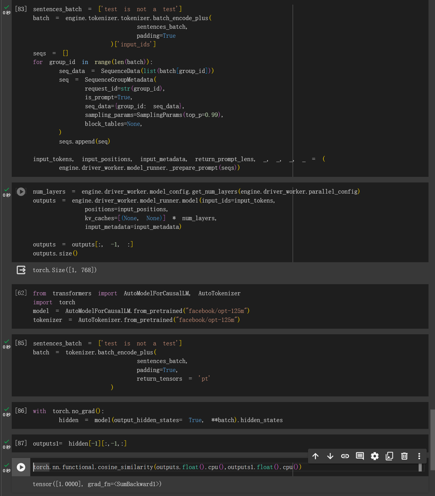

# vllm4mteb
vllm for embedding tasks

https://github.com/kongds/scaling_sentemb

This is the code to accelate the inference of scaling sentemb project.

You need to change the model info in python code.

Then

python run_array_decoder_vllm.py

I make two examples of not using vllm, and one with.

The result is same.

## Example

1. git clone lora from https://huggingface.co/royokong/prompteol-opt-2.7b
2. git clone opt2.7b
3. python run_array_decoder_vllm.py --lora_weight prompteol-opt-2.7b

## Dependence

vllm <= 0.22

After 0.22, they change the api. 当初分析代码花了很久，没兴趣再做一遍了。

I was using vllm 0.21, when initially develop this project.

## 针对最新版 Latest vllm

感谢@guankaisi的提醒，vllm的函数改了。
目前做了一个demo (vllm-new 文件)，新版的函数也可以用。晚些再改。

## 其他

我颇为确定 https://arxiv.org/pdf/2401.00368.pdf intfloat/e5-mistral-7b-instruct 没有充分利用模型，我手头就有一个STS比他高的。

用Qwen embedding的代码我改了一下，Qwen Batch的话，他是tiktoken不能取-1，要根据attention mask来算。然后Qwen这种模型，使用中文Prompt还是英文Prompt好，请自己试一下，结果跟我说说？

训练这个东西大Batch size是必须的。