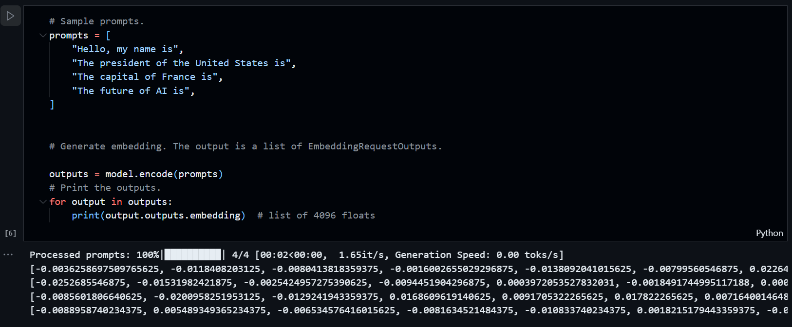

# vllm4mteb
> 支持了Qwen2

## Notice 可能要注意的问题
### Problem 1
https://github.com/vllm-project/vllm/blob/main/vllm/model_executor/models/llama_embedding.py is not working with raw LLM!

这个脚本在没有用Sentence-bert训练过的模型上是用不了的，建议参考我这个项目的MTEB

https://github.com/vllm-project/vllm/blob/4ef41b84766670c1bd8079f58d35bf32b5bcb3ab/vllm/model_executor/models/llama_embedding.py#L77 Problem is here

问题出在加载权重上。

此外，lm_head也不要加载！正常Dense Embedding模型是完全不用这个的。
```
if "lm_head" in name: 
    continue
``` 
is a must.

### Problem 2 务必请修改config.json **Don't miss architecture change in config.json**
```
{
  ...
  "architectures": [
    "LlamaForCausalLM"
  ],
  ...
}
```
Change / 修改
```
{
  ...
  "architectures": [
    "MyLlamaEmbeddingModel"
  ],
  ...
}
```
修改成和你自定义的Embedding Class一样的architectures，目的是让vLLM认为是你新实现的模型！

If not, this is the problem!! 如果你不改就是这个错误！！
```
[rank0]: File "python3.11/site-packages/vllm/worker/embedding_model_runner.py", line 122, in execute_model
[rank0]: self.model.pooler(hidden_states=hidden_states,
[rank0]: ^^^^^^^^^^^^^^^^^
[rank0]: File "python3.11/site-packages/torch/nn/modules/module.py", line 1729, in getattr
[rank0]: raise AttributeError(f"'{type(self).name}' object has no attribute '{name}'")
[rank0]: AttributeError: 'LlamaForCausalLM' object has no attribute 'pooler'
```
不然的话就出现这个问题！LlamaForCausalLM这个模型架构明显不对！

## New Instructions

> The project is nearing its conclusion! It now supports the latest vLLM!


vLLM has basic support for Embedding, though it's not very convenient. Pooling only supports one method, which we suggest solving with a MonkeyPatch.

For the final solution, refer to `vllm4emb.ipynb`, which provides a way to solve this without modifying the codebase. The principle is to register our Embedding model. Essentially, it's just importing a few files and copying and pasting some code.

```python
from vllm import ModelRegistry
ModelRegistry.register_model("MyLlamaEmbeddingModel", MyLlamaEmbeddingModel)
```

See the detailed comments in the notebook. You need to patch the `ModelRegistry.is_embedding_model` method, as the author did not anticipate the need for registering out-of-the-box Embedding models.

> https://github.com/vllm-project/vllm/blob/388596c91437a51d428a447594e9faec340c29b2/vllm/model_executor/layers/pooler.py#L44
This implementation should support Qwen's tiktoken tokenizer, so compatibility issues are minimal.

## 新的说明(中文)

> 本项目应该迎来大结局了！支持最新的vLLM！


vLLM算是正常支持Embedding了，只是支持的不太舒服。Pooling也只支持一种，这个建议MonkeyPatch来解决。

最后的解决办法请见`vllm4emb.ipynb`，提供了一种不修改codebase的方法来解决，原理就是把我们的Embedding模型注册上去，其实就是导入几个文件，复制黏贴一下就行了。

```
from vllm import ModelRegistry
ModelRegistry.register_model("MyLlamaEmbeddingModel", MyLlamaEmbeddingModel)
```

详细注释看ipynb，需要Patch `ModelRegistry.is_embedding_model` 这个方法，这个作者并没有考虑额外注册OOT的Embedding模型的需求。

> https://github.com/vllm-project/vllm/blob/388596c91437a51d428a447594e9faec340c29b2/vllm/model_executor/layers/pooler.py#L44
他这个写法应该是支持Qwen的tiktoken分词的，所以基本上兼容问题不大了。

Qwen2的版本也给了！

## 其他

我颇为确定 https://arxiv.org/pdf/2401.00368.pdf intfloat/e5-mistral-7b-instruct 没有充分利用模型，我手头就有一个STS比他高的。

用Qwen embedding的代码我改了一下，Qwen Batch的话，他是tiktoken不能取-1，要根据attention mask来算。然后Qwen这种模型，使用中文Prompt还是英文Prompt好，请自己试一下，结果跟我说说？

训练这个东西大Batch size是必须的。
